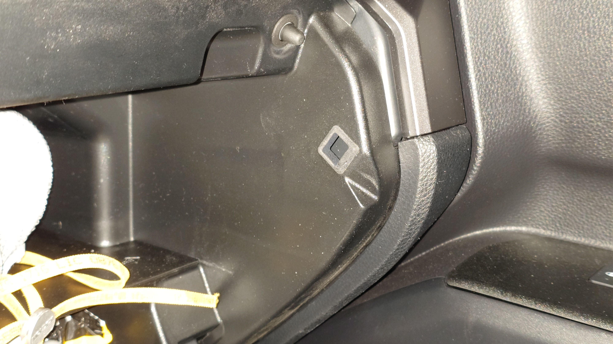
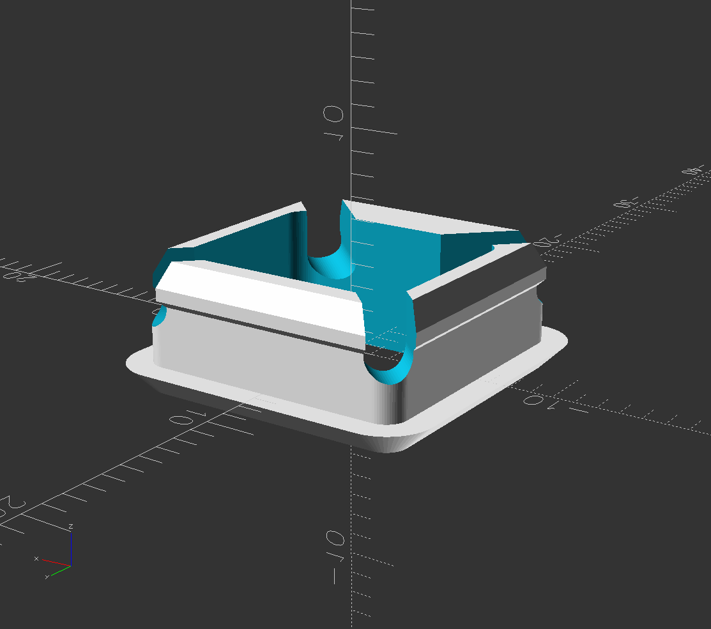

# 2025 4Runner glove box latch grommet

Parametric latch grommet generator.

The default values generate a gommet for the latches for the glove box door on a 6th gen (2025+) Toyota 4Runner.  
In the default case for the 6th gen 4Runner, install with the thick wall towards the rear of the vehicle.

[Buy from JawsTec](https://shop.jawstec.com/3d-printed-2025-4runner-glove-box-latch-grommet_p640.php)  
(Select: MJF Nylon (not glass filled), Black color, No polish, Quantity 2 per vehicle.)

[STL for printing](out)

## Customization
(all values in mm)

Open the scad file in openscad, and enable the customizer panel.

If you have some other vehicle besides a 2025 4Runner and the holes in the glove box are not 13x13, just measure your holes and edit  
`glove_box_hole_vertical`  
`glove_box_hole_horizontal`

If the default model is too tight, and flipping the other way is too loose, reduce `pawl_hole_horizontal_offset`.

If the hole in the middle is too wide or too narrow for your pawl, edt `pawl_horizontal`.  
This should be the thickness of the pawl from front to back.

For `glove_box_hole_*` and `pawl_horizontal`, just use the actual dimensions of the features on the vehicle, don't try to adjust for clearance, there are other seperate values that add clearances.

### Fancy Compliant SLS MJF
If you want there is also a fancy version with a larger retainer bump and slots cut in the corners to make the retainer more compliant.  
This version is probably not good to print at home on a normal FDM printer because the tabs will likely break off.  
So this is really only for getting commercially printed using SLS or MJF.  
To generate or customize this version, select the "Fancy Compliant SLS MJF" saved config in the customizer panel.  
The interesting parameters for this version are:  
`retainer_slots_depth_percent` Anything greater than 0 enables the slots, and you want something between 50 to 100.  
And since the slots make the insert compliant, `retainer_oversize` can be increased to make a more solid snap.  

